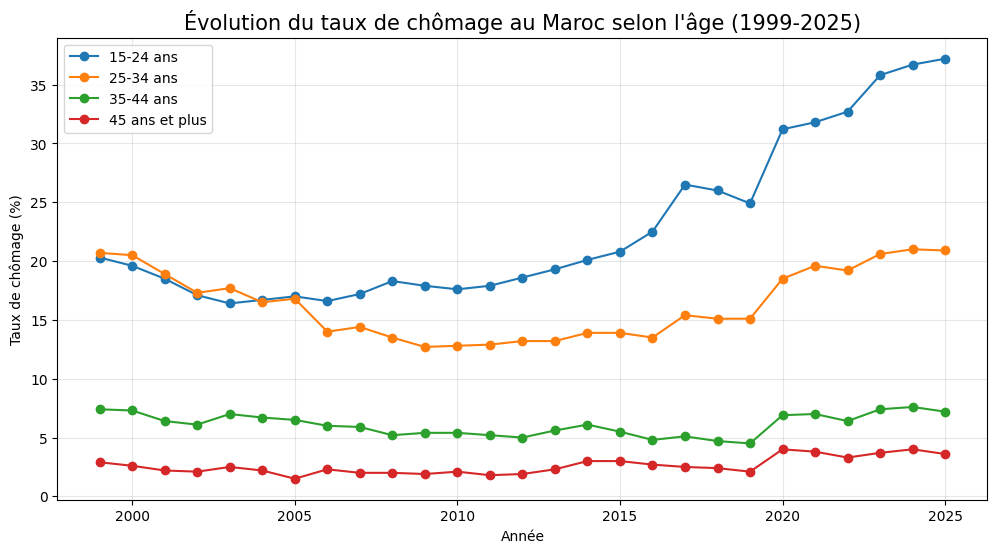

# 🇲🇦 Analyse du chômage au Maroc par tranche d'âge (1999–2025)

## 📊 Présentation du projet

Ce projet a pour objectif d'analyser l'évolution du **taux de chômage au Maroc entre 1999 et 2025**, en mettant l'accent sur les différentes tranches d'âge.

L'analyse compare :

* 🇲🇦 Le taux de chômage national (**Ensemble**)
* 👥 Le taux de chômage des jeunes de **15 à 24 ans**
* 👤 Le taux de chômage des personnes de **25 à 34 ans**

Les données sont analysées avec **Python**, à l'aide des bibliothèques **Pandas** et **Matplotlib**.

---

## 🎯 Objectifs

* Étudier l'évolution du chômage au Maroc sur la période 1999–2025.
* Comparer le chômage national avec celui des jeunes et des adultes.
* Identifier les tendances et variations du taux de chômage.
* Représenter les données sous forme de graphique.
* Mettre en pratique l'analyse et la visualisation de données avec Python.

---

## 🗂️ Structure du projet

```text
analyse-chomage-maroc/
│
├── chomage_age.csv
├── graphique_chomage.png
├── analyse_chomage.py
└── README.md
```

### 📄 Description des fichiers

| Fichier                 | Description                             |
| ----------------------- | --------------------------------------- |
| `chomage_age.csv`       | Données sur le taux de chômage au Maroc |
| `graphique_chomage.png` | Graphique généré à partir des données   |
| `analyse_chomage.py`    | Script Python utilisé pour l'analyse    |
| `README.md`             | Documentation du projet                 |

---

## 🛠️ Technologies utilisées

* 🐍 **Python**
* 🐼 **Pandas**
* 📊 **Matplotlib**
* 📄 **CSV**
* 💻 **Git & GitHub**

---

## 📁 Données

Le fichier `chomage_age.csv` contient les données annuelles utilisées pour l'analyse.

Les principales colonnes sont :

```text
Annee
Ensemble
15-24
25-34
```

### Signification des variables

| Variable   | Description                                        |
| ---------- | -------------------------------------------------- |
| `Annee`    | Année d'observation                                |
| `Ensemble` | Taux de chômage national                           |
| `15-24`    | Taux de chômage des personnes âgées de 15 à 24 ans |
| `25-34`    | Taux de chômage des personnes âgées de 25 à 34 ans |

---

## 📈 Visualisation

Le projet génère une courbe permettant de comparer l'évolution des différents taux de chômage.



Le graphique représente :

* **Noir** : taux de chômage national
* **Rouge** : chômage des jeunes de 15–24 ans
* **Orange** : chômage des 25–34 ans

---

## 🐍 Code Python

L'analyse est réalisée avec Pandas et Matplotlib.

```python
import pandas as pd
import matplotlib.pyplot as plt

# Chargement des données
df = pd.read_csv('chomage_age.csv')

# Tri des données par année
df = df.sort_values(by='Annee')

# Création du graphique
plt.figure(figsize=(12, 6))

plt.plot(
    df['Annee'],
    df['Ensemble'],
    marker='o',
    label='Taux National (Ensemble)',
    color='black',
    linewidth=2.5
)

plt.plot(
    df['Annee'],
    df['15-24'],
    marker='s',
    label='Jeunes (15-24 ans)',
    color='red',
    linewidth=2
)

plt.plot(
    df['Annee'],
    df['25-34'],
    marker='^',
    label='Adultes (25-34 ans)',
    color='orange',
    linewidth=1.5
)

# Personnalisation
plt.title(
    "Évolution du taux de chômage au Maroc par tranche d'âge (1999-2025)",
    fontsize=13,
    fontweight='bold'
)

plt.xlabel('Année', fontsize=11)
plt.ylabel('Taux de chômage (%)', fontsize=11)

plt.xticks(df['Annee'][::2], rotation=45)

plt.grid(True, linestyle='--', alpha=0.6)
plt.legend()

# Sauvegarde du graphique
plt.savefig(
    'graphique_chomage.png',
    dpi=300,
```
